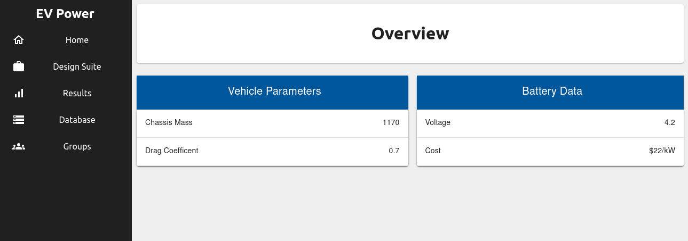

# Energy Analytics

<!-- TABLE OF CONTENTS -->
## Table of Contents

* [About the Project](#about)
  * [Built With](#built-with)
* [License](#license)
* [Contact](#contact)

<!-- ABOUT THE PROJECT -->
## About

This project uses the Arduino MKR WiFi 1010 to send data to the AWS IoT Core. From there the data is forwarded to an S3 bucket.

The website, a React frontend is used to call a backend service built using Python.
The backend service uses the AWS SDK to get the latest battery voltage from the S3 bucket and forwards that to the frontend to display it.

*Only the 'Voltage' value is retrieved from S3, the rest is hard-coded.*

### Built With

* [Arduino MKR WiFi 1010](https://docs.arduino.cc/hardware/mkr-wifi-1010)
* [AWS IoT Core](https://docs.aws.amazon.com/iot/index.html)
* [React](https://reactjs.org/)
* [Python](https://www.python.org/)

<!-- LICENSE -->
## License

Distributed under the MIT License. See `LICENSE` for more information.

<!-- CONTACT -->
## Contact

Halldor Stefansson - halldor@halldorstefans.com
